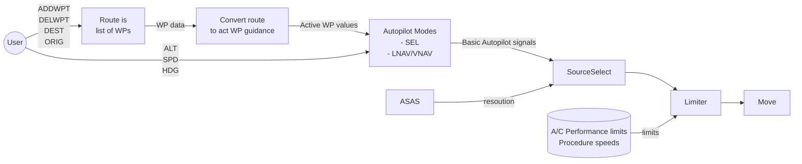
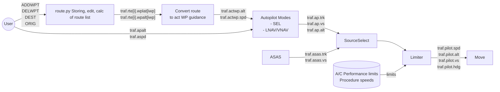

## Bluesky control and guidance architecture

```mermaid
flowchart LR;
     
    User((User)) --> |ADDWPT
DELWPT
DEST
ORIG| Route[Route is
            list of WPs] --> |WP data|RouteGuidance[Convert route
            to act WP guidance] --> |Active WP values| AP[Autopilot Modes
            - SEL
            - LNAV/VNAV ];

    
AP-->| Basic Autopilot signals| SourceSelect;
    ASAS--> |resoution|SourceSelect;
    SourceSelect-->Limiter
    Limits[(A/C Performance limits
    Procedure speeds)]-->|limits|Limiter;
    Limiter-->Move;

User-->|ALT
  SPD
  HDG
 |AP
```

```mermaid
flowchart LR;
     
    User((User)) --> |ADDWPT
DELWPT
DEST
ORIG| Route[route.py Storing, edit, calc of route list] --> |"traf.rte[i].wplat[iwp]
traf.rte[i].wpalt[iwp] "|RouteGuidance[Convert route
            to act WP guidance] --> |traf.actwp.alt
traf.actwp.spd| AP[Autopilot Modes
            - SEL
            - LNAV/VNAV ];

    
AP-->| traf.ap.trk
traf.ap.vs
traf.ap.alt| SourceSelect;
    ASAS--> |traf.asas.trk
traf.asas.vs|SourceSelect;
    SourceSelect-->Limiter
    Limits[(A/C Performance limits
    Procedure speeds)]-->|limits|Limiter;
    Limiter-->|traf.pilot.spd
traf.pilot.alt
traf.pilot.vs
traf.pilot.hdg|Move;

User-->|traf.apalt
  traf.aspd
 |AP
```

